# Derivatives Underwriting Workbench

[](https://github.com/ccharafeddine/Derivatives_Underwriting_Workbench/actions/workflows/ci.yml)
[](https://www.python.org/downloads/)
[](https://doc.qt.io/qtforpython/)
[](https://github.com/astral-sh/ruff)
[](LICENSE)

A desktop application that reconstructs the counterparty-credit underwriting
workflow for OTC derivatives. Give it a proposed trade — an interest rate swap,
FX forward, credit default swap, swaption, or cross-currency swap — and it
quantifies the counterparty exposure the trade creates, prices in the
counterparty's credit risk (CVA/DVA/FVA, with a wrong-way-risk option), checks it
against limits, models the effect of collateral, reports risk sensitivities, and
produces an underwriting memo with a recommendation.

Built with PySide6/Qt6. Runs fully offline on a bundled synthetic market
snapshot; can optionally pull public-company financials for counterparty credit
analysis.

> **This is an educational portfolio project.** It runs on synthetic and public
> data only. It is not a production risk system, executes no trades, and is not
> affiliated with or endorsed by any financial institution. Nothing it produces
> is investment, credit, or legal advice.

---

## What it does

A corporate derivatives underwriting desk answers one question for every
proposed trade: *should we take this counterparty exposure, at what limit, with
what collateral, and what does it do to our book?* This app models that
decision end to end.

### 1. Trade

Capture a proposed trade as a term sheet: product (interest rate swap, FX
forward, credit default swap, European swaption, or cross-currency swap),
notional, tenor, direction, and the economic terms for each leg. The trade is
added to the counterparty's existing netting set so exposure is measured on the
net position, the way an ISDA master agreement actually works.

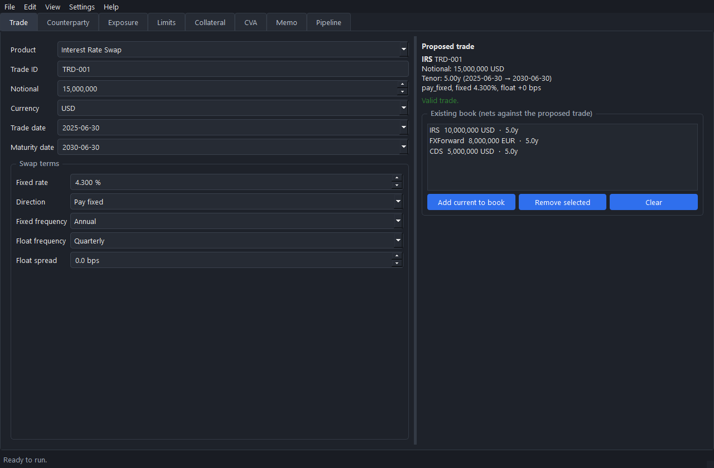

### 2. Counterparty

Assess the counterparty's creditworthiness. A KMV-style Merton model derives a
distance-to-default and default probability from equity value and volatility; an
Altman Z-score summarizes balance-sheet health; the two are mapped to an
internal rating grade and a probability-of-default term structure. Enter a public
ticker and **Fetch** pulls the company's financials via yfinance (offline-safe,
degrading to synthetic data); private names come from the bundled synthetic set.

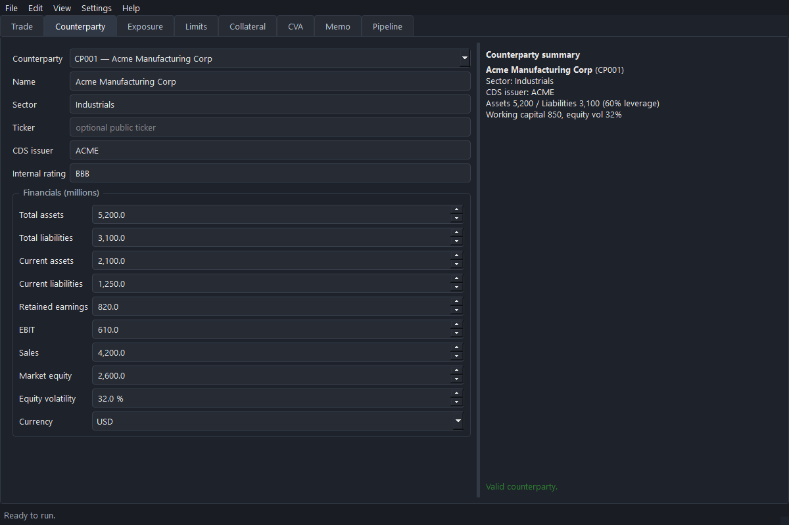

### 3. Market

Inspect and edit the market the trade is priced against: zero curves by currency,
FX spots, and CDS spread curves by issuer. Change a rate, spot, or spread and
Apply, and the next analysis prices against your values — a quick way to test how
the drivers move exposure and CVA (or reset to the bundled snapshot).

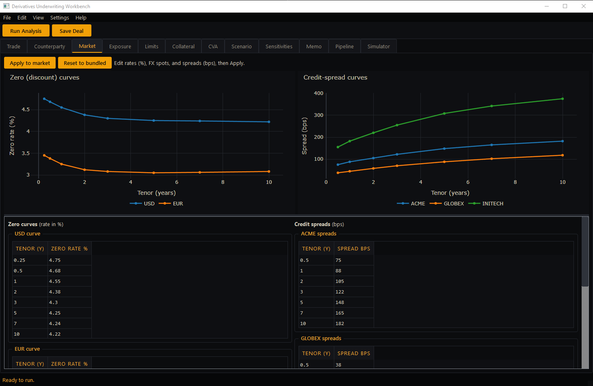

### 4. Exposure

The core engine. Monte Carlo simulation evolves the trade's risk factors
(interest rates, FX, credit spreads) forward over the trade's life, reprices the
netting set on every path at every date, and reads off the exposure profile:

- **Expected Exposure (EE)** and **Expected Positive Exposure (EPE)**
- **Potential Future Exposure (PFE)** at 95% and 99%, and **peak PFE**
- The full exposure cone over time

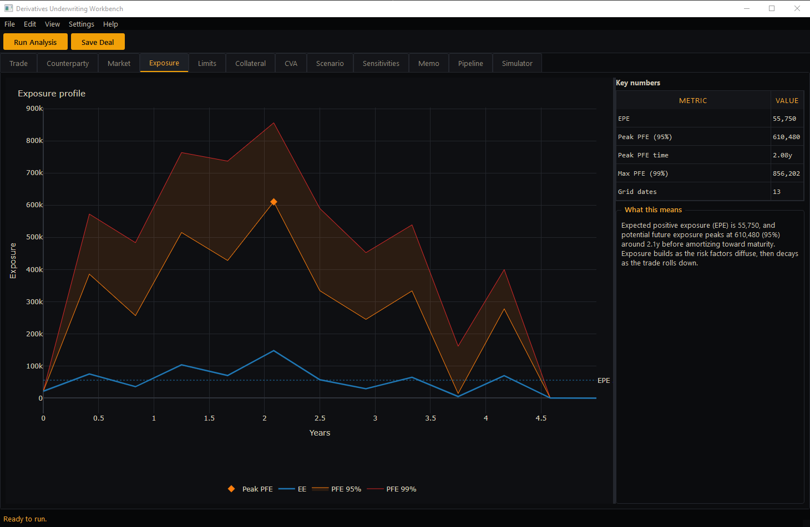

### 5. Limits

Check the trade against a per-counterparty credit limit. The netting set is
aggregated across existing and proposed trades to show current utilization,
remaining headroom, the **incremental** exposure the new trade adds, and a clear
flag when it would breach the limit.

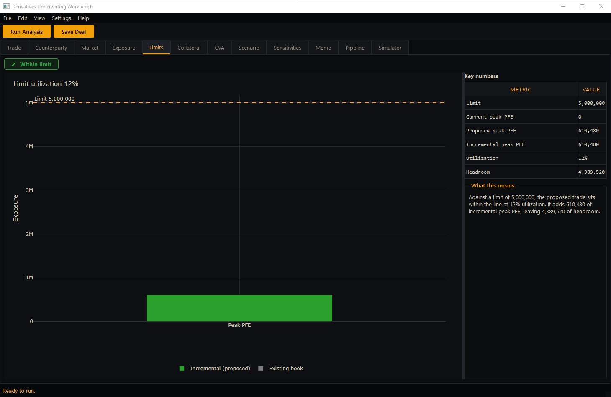

### 6. Collateral

Model a Credit Support Annex — threshold, minimum transfer amount, initial
margin, and margin period of risk — and see how much it reduces exposure.
Collateralized and uncollateralized PFE are shown side by side so the risk
mitigation is explicit.

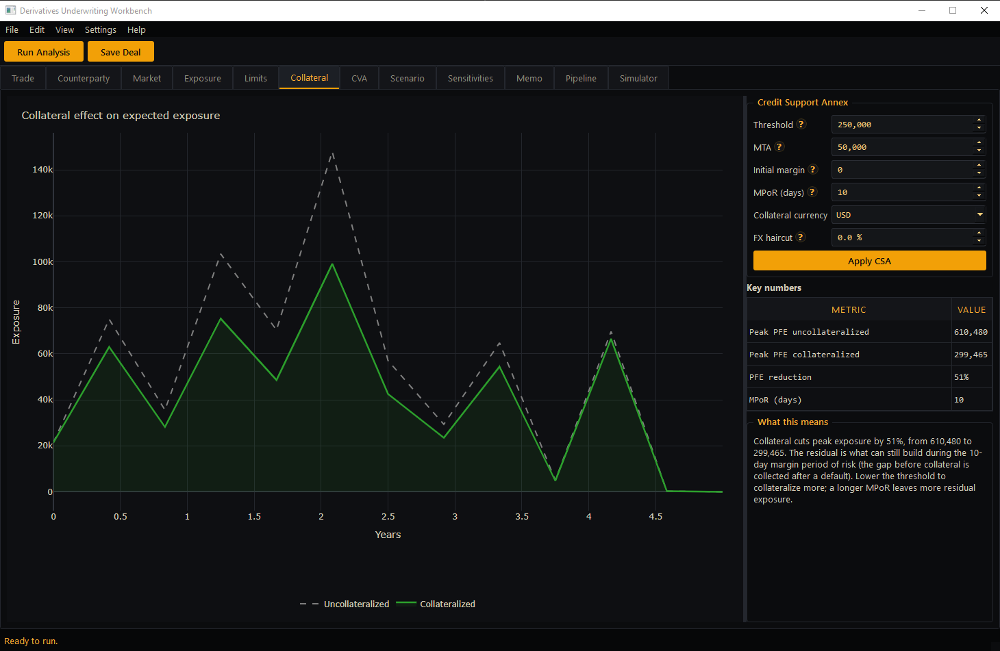

### 7. CVA

Compute the Credit Valuation Adjustment: the market value of the counterparty's
default risk, built from the expected-exposure profile, the counterparty's
survival curve, and discounting. The symmetric own-credit adjustment (DVA), the
bilateral net (BCVA), and a funding valuation adjustment (FVA) are reported
alongside. A **wrong-way risk** correlation (set in Preferences) tilts expected
exposure toward its higher paths, raising CVA when exposure rises with default
risk.

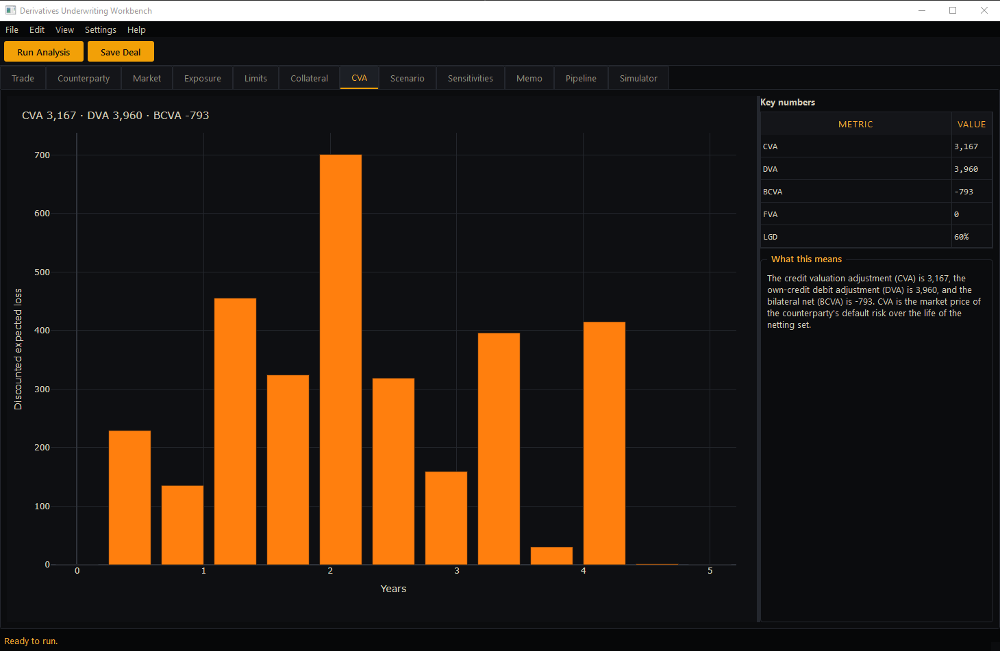

### 8. Scenario

Stress test the proposed trade. Apply market shocks — a parallel rate shift, a
curve steepener/flattener, an FX move, and credit-spread widening (with named
presets like *Risk-off* and *Credit crunch*) — and re-run to compare base vs
stressed exposure, CVA, and limit utilization side by side, with the two
exposure profiles overlaid.

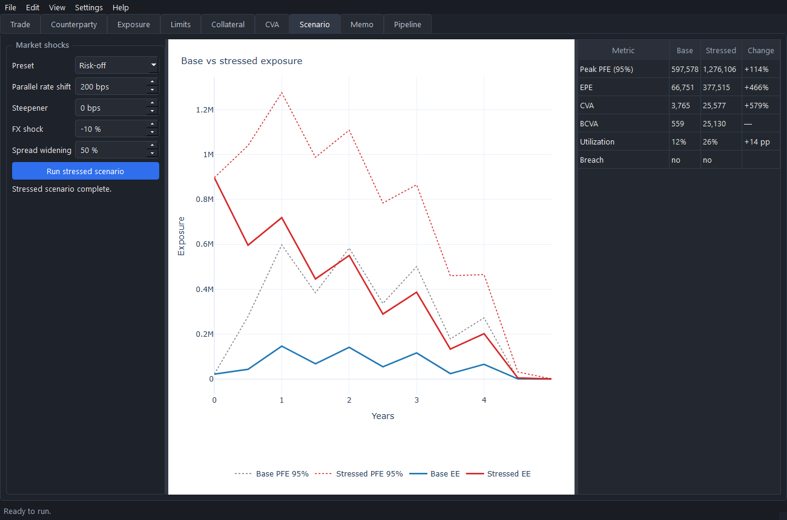

### 9. Sensitivities

Bump-and-reprice risk sensitivities of the headline numbers: DV01 (per 1bp
parallel rate move) and FX delta (per 1% FX move) of peak PFE and CVA, and CS01
(per 1bp credit-spread move) of CVA. Every bump reuses the same Monte Carlo seed
(common random numbers) so the difference reflects the market move, not
simulation noise.

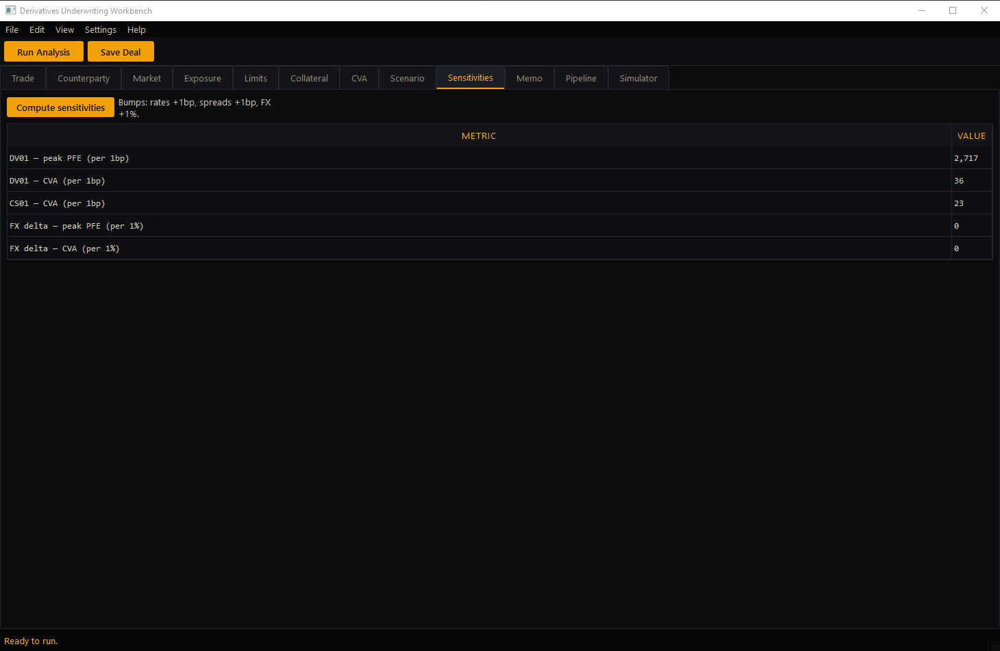

### 10. Memo

Generate a one-page underwriting memo: trade summary, counterparty snapshot,
exposure metrics, collateral effect, CVA, limit impact, and a recommendation.
Plain-English commentary is generated across every section by an interpretation
engine. Exportable as HTML and PDF, with an optional client-facing slide deck.

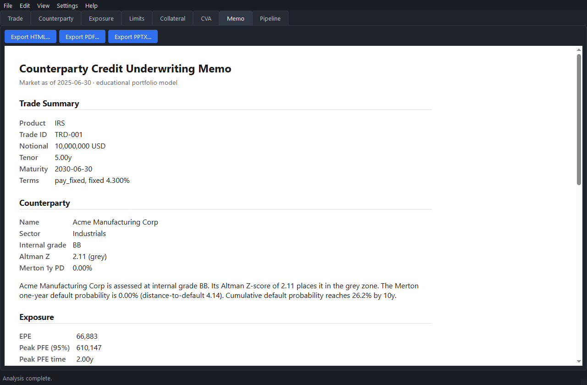

### 11. Pipeline

Track multiple transactions through their approval stages — Requested → Under
review → Credit approved → Documented → Executed — since underwriting means
juggling many deals at different stages at once. Runs are saved locally and can
be reopened.

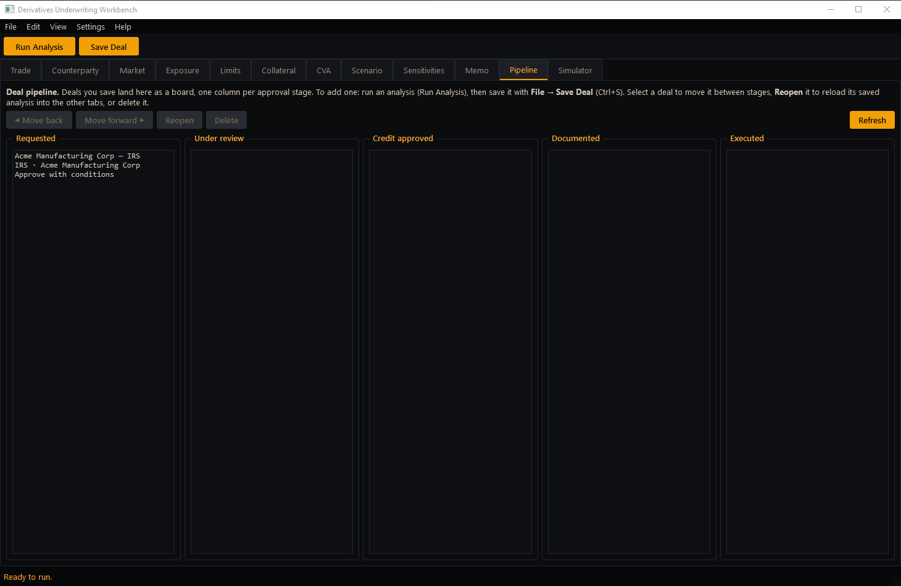

---

## Pipeline architecture

A single underwriting run executes twelve steps sequentially. Each step reads
all prior results and stores its outputs in a shared `AnalysisResults`
dataclass. The pipeline runs on a background thread with a live progress bar;
report generation happens on demand.

```
Step  0  Load market snapshot        Curves, FX rates, credit spreads, vols
Step  1  Build trade + netting set    Proposed trade added to counterparty's set
Step  2  Assess counterparty credit   Merton DtD, Altman Z, rating, PD curve
Step  3  Simulate risk factors        Monte Carlo paths (rates / FX / spread)
Step  4  Reprice across time grid      MtM cube across trades, paths, and dates
Step  5  Aggregate netting set         Net MtM per path and date
Step  6  Compute exposure profile      EE, EPE, PFE (95/99), peak PFE, cone
Step  7  Apply collateral (CSA)        Collateralized vs uncollateralized exposure
Step  8  Compute CVA / DVA / BCVA      EE profile x marginal PD x discounting
Step  9  Check limits                  Utilization, headroom, incremental, breach
Step 10  Interpret + generate memo     Commentary and recommendation
Step 11  Save outputs                  Run config (JSON) + HTML/PDF/PPTX reports
```

Every run is reproducible: the Monte Carlo seed and the full run configuration
are saved with the outputs.

---

## Tech stack

- **Python 3.11+**, **PySide6 / Qt6** (menu-bar desktop UI, `QSplitter` panels)
- **numpy / pandas / scipy** for pricing, simulation, and credit models
- **plotly** (+ **kaleido**) for charts; **reportlab** and **python-pptx** for reports
- **pyarrow / parquet** for market-data caching
- **yfinance** (optional) for public-company financials
- **ruff** and **pytest** for linting and headless testing

Numeric models (`pricing/`, `risk/`, `credit/`, `pipeline/`) are pure Python
with no Qt dependency and are unit-tested headlessly. Qt is confined to the UI,
the app entry point, and the background worker.

---

## Getting started

```bash
# create and activate a virtual environment, then:
pip install -e ".[dev]"

# launch the app
python -m duw.app

# run the test suite headlessly
QT_QPA_PLATFORM=offscreen pytest -q

# lint and format
ruff check . && ruff format .
```

The app launches against the bundled synthetic market snapshot and seed
counterparties, so it works with no configuration and no network access. New to
the workflow? **Help → Load Example** loads a ready-made deal (investment-grade
swap, distressed-name CDS, a limit-breaching trade, a netted book) you can run in
one click, **Help → Glossary** explains every term, and each metric shows a
plain-English tooltip on hover. Monte Carlo settings (paths, seed, default LGD)
live under **Settings → Preferences**, the theme toggles under **View → Theme**,
and the disclaimer is in **Help → About**. Saved deals persist locally and reopen
with the same seed, so any run reproduces exactly.

To build a native desktop binary (`.msi` / `.dmg`), see
[PACKAGING.md](PACKAGING.md).

---

## Scope

v1 covers interest rate swaps, FX forwards, and credit default swaps;
counterparty credit via Merton and Altman; Monte Carlo exposure with EE/PFE;
CVA/DVA; CSA collateral modeling; limit checking; the underwriting memo; and the
deal pipeline. Wrong-way risk, XVA terms beyond CVA/DVA, multi-currency
collateral, and additional products are deliberately out of scope and left as
extension points.

---

## Disclaimer

This software is provided for educational and demonstration purposes only. It
uses synthetic and publicly available data, models simplified versions of
real methodologies, and is not affiliated with, endorsed by, or connected to any
bank or financial institution. It does not execute or facilitate trades and
produces no investment, credit, or legal advice. Do not use it for any real
underwriting, trading, or credit decision.
